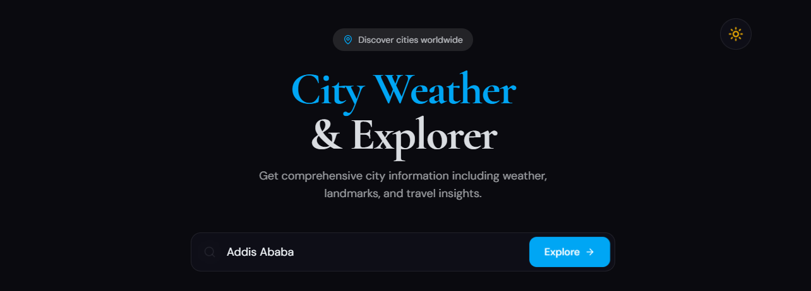

# Agentic Weather App 🌤️

A modern Next.js weather explorer that combines live city weather, Wikipedia summaries, AI-powered city insights, and curated imagery in one responsive interface.



## 🖼️ UI & Data Flow

This app follows a simple, visual workflow from search to insight in both dark/light theme.

### 1. City search input

Enter a city name in the search bar to begin the workflow.


The app resolves the search into a city plus country and coordinates.


### 3. Current weather display

Live weather conditions are shown with temperature, humidity, wind, and condition.


### 4. City overview with Wikipedia summary

A summarized city profile appears with context and an external reference.


### 5. AI-generated insights

LLM-powered sections highlight culture, history, and travel guidance.


### 6. City imagery carousel

Relevant photos are displayed from Pexels or smart fallback imagery.


## ✨ What This Project Includes

- **City search** for weather and location details
- **Open-Meteo geocoding** to resolve city names to coordinates
- **Open-Meteo current weather** for temperature, humidity, wind, and condition
- **Wikipedia overview** for each city
- **AI city insights** generated via Ollama, OpenRouter, or Groq
- **Pexels image search** with fallback placeholder images when API credentials are missing
- **Responsive UI** with theme toggle support and animated transitions

## 🛠️ Technologies Used

- **Next.js 15** with App Router
- **React 19** + **TypeScript**
- **Tailwind CSS 4**
- **Next Themes** for dark/light mode
- **Lucide React** icons
- **Framer Motion** for subtle reveal animations

## 🌐 APIs & Integration

- **Open-Meteo** for geocoding and weather data
- **Wikipedia** for city overviews
- **Pexels** for city image search
- **Ollama / OpenRouter / Groq** for AI-generated city insights

## 🚀 Run Locally

### Prerequisites

- Node.js 18.17 or later
- npm or yarn
- Ollama (optional if using the local LLM provider)

### Setup

1. Clone the repository:

   ```bash
   git clone <repository-url>
   cd agentic-weather-app
   ```

2. Install dependencies:

   ```bash
   npm install
   # or
   yarn install
   ```

3. Create a `.env.local` file in the project root with the following values:

   ```env
   # LLM provider (one of ollama, openrouter, groq)
   LLM_PROVIDER=ollama

   # Ollama local LLM settings
   OLLAMA_MODEL=llama3.2
   OLLAMA_URL=http://localhost:11434

   # OpenRouter settings
   # OPENROUTER_API_KEY=your-api-key
   # OPENROUTER_MODEL=anthropic/claude-3-haiku

   # Groq settings
   # GROQ_API_KEY=your-api-key
   # GROQ_MODEL=llama-3.1-70b-versatile

   # Optional Pexels API key for better city photos
   # PEXELS_API_KEY=your-pexels-api-key
   ```

4. If you use the local Ollama provider, start Ollama:

   ```bash
   ollama pull llama3.2
   ollama serve
   ```

5. Run the app:

   ```bash
   npm run dev
   # or
   yarn dev
   ```

6. Open [http://localhost:3000](http://localhost:3000)

## 📁 Project Structure

```text
src/
├── app/
│   ├── api/
│   │   └── weather/
│   │       └── route.ts       # API handler for city weather workflow
│   ├── globals.css            # Global CSS
│   ├── layout.tsx             # App shell and metadata
│   ├── page.tsx               # Main weather search UI
│   └── providers.tsx          # Theme provider setup
├── lib/
│   ├── llm.ts                 # Local/cross-provider LLM integration
│   └── pexels.ts              # Pexels image search and fallback logic
```

## 🔧 API Endpoint

- **Endpoint**: `/api/weather`
- **Method**: `POST`
- **Body**:
  ```json
  { "location": "city-name" }
  ```
- **Returns**: city info, current weather, Wikipedia summary, AI insights, and city images

## 📄 Scripts

- `npm run dev` — start development server
- `npm run build` — production build
- `npm run start` — start production server
- `npm run lint` — run Next.js lint checks

## 🤝 Contributing

1. Fork the repo
2. Create a branch: `git checkout -b feature/my-feature`
3. Commit your changes
4. Push and open a pull request

## 📄 License

MIT License

## 🙏 Acknowledgments

- [Open-Meteo](https://open-meteo.com/)
- [Wikipedia](https://www.wikipedia.org/)
- [Pexels](https://www.pexels.com/)
- [Ollama](https://ollama.ai/) for local AI inference
