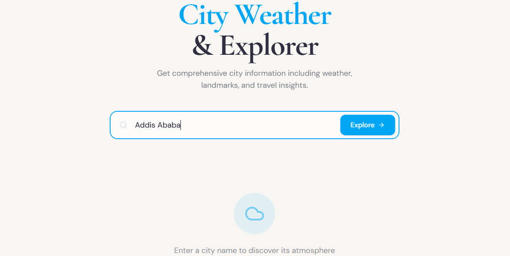
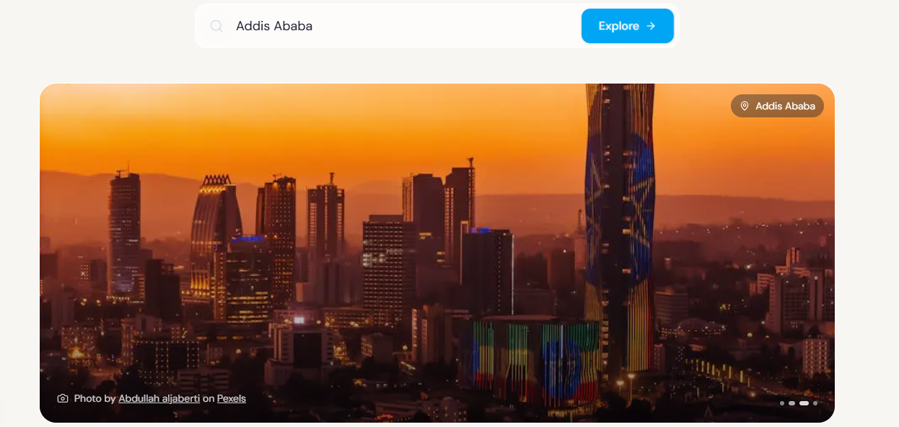
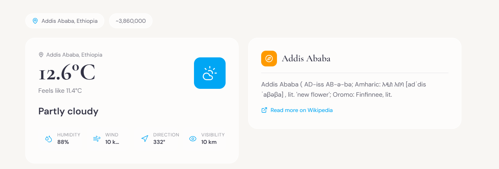
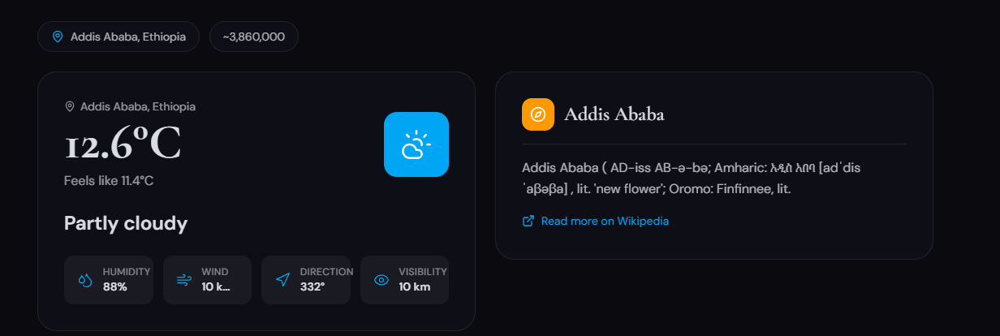

# City Weather Explorer 🌤️

A modern Single Page Application (SPA) built with Next.js that allows users to explore weather conditions and interesting facts about cities around the world. This agentic weather app leverages AI to provide unique insights about each city.



## ✨ What This Project Achieves

This project demonstrates a fully-featured weather application with the following capabilities:

- **Real-time Weather Data**: Fetches current weather conditions for any city worldwide using the Open-Meteo API
- **AI-Powered City Insights**: Uses Large Language Models (LLM) to generate interesting facts and historical information about cities
- **City Imagery**: Retrieves beautiful city photographs from Pexels API
- **Geocoding**: Converts city names to coordinates using Open-Meteo's geocoding service
- **Wikipedia Integration**: Fetches city overviews and information from Wikipedia
- **Modern UI/UX**: Beautiful, responsive interface with smooth animations and theme support

## 🛠️ Tools & Technologies Used

### Core Framework

- **Next.js 15** - React framework with App Router
- **TypeScript** - Type-safe development
- **React 19** - UI library

### Styling & UI

- **Tailwind CSS 4** - Utility-first CSS framework
- **Framer Motion** - Smooth animations and transitions
- **Lucide React** - Beautiful icon library
- **Next Themes** - Dark/Light theme management

### APIs & Services

- **Open-Meteo API** - Free weather and geocoding API
- **Wikipedia API** - City information and overviews
- **Pexels API** - High-quality city images
- **LLM Providers** (one of):
  - **Ollama** - Local LLM (default)
  - **OpenRouter** - Cloud LLM routing
  - **Groq** - Fast inference API

### Development Tools

- **ESLint** - Code linting
- **PostCSS** - CSS processing
- **TypeScript** - Type checking

## 🚀 How to Run the Project

### Prerequisites

1. **Node.js** 18.17 or later
2. **npm** or **yarn** package manager
3. **Ollama** (optional - for local LLM, or use OpenRouter/Groq)

### Installation Steps

1. **Clone the repository:**

   ```bash
   git clone <repository-url>
   cd city-weather-explorer
   ```

2. **Install dependencies:**

   ```bash
   npm install
   # or
   yarn install
   ```

3. **Configure environment variables:**

   Create a `.env.local` file in the root directory:

   ```env
   # API Configuration
   NEXT_PUBLIC_API_URL=http://localhost:3000/api

   # LLM Configuration (choose one)
   # Option 1: Ollama (local) - default
   LLM_PROVIDER=ollama
   OLLAMA_MODEL=llama3.2
   OLLAMA_URL=http://localhost:11434

   # Option 2: OpenRouter (cloud)
   # LLM_PROVIDER=openrouter
   # OPENROUTER_API_KEY=your-api-key
   # OPENROUTER_MODEL=anthropic/claude-3-haiku

   # Option 3: Groq (fast cloud)
   # LLM_PROVIDER=groq
   # GROQ_API_KEY=your-api-key
   # GROQ_MODEL=llama-3.1-70b-versatile

   # Pexels API (optional - for city images)
   # PEXELS_API_KEY=your-pexels-api-key
   ```

4. **Start Ollama (if using local LLM):**

   ```bash
   # Pull the model if needed
   ollama pull llama3.2

   # Start Ollama server
   ollama serve
   ```

5. **Start the development server:**

   ```bash
   npm run dev
   # or
   yarn dev
   ```

6. **Open the application:**
   Navigate to [http://localhost:3000](http://localhost:3000) in your browser.

## 📸 Application Screenshots

### 1. Main Interface

The main weather explorer interface with search functionality and clean design.


### 2. City Photo

Search for any city worldwide with intelligent suggestions for misspelled names.



### 3. Weather Display

View current weather conditions including temperature, humidity, wind speed, and weather condition with animated icons.



### 4. City Information

Get comprehensive city details including population, location coordinates, Wikipedia overview, and beautiful city photographs.



### 5. AI-Generated Insights

Receive unique, AI-generated interesting facts about each city powered by LLM.


### 6. Theme Support

Toggle between light and dark modes for comfortable viewing in any environment.


## 📁 Project Structure

```
src/
├── app/
│   ├── api/
│   │   └── weather/
│   │       └── route.ts       # Weather API endpoint
│   ├── globals.css            # Global styles
│   ├── layout.tsx             # Root layout
│   ├── page.tsx               # Main page component
│   └── providers.tsx          # Theme providers
├── lib/
│   ├── llm.ts                 # LLM integration
│   └── pexels.ts              # Pexels API client
```

## 🔧 API Endpoint

### Weather Information

- **Endpoint**: `/api/weather`
- **Method**: POST
- **Request Body**:
  ```json
  {
    "location": "city-name"
  }
  ```
- **Response**: Weather data, city overview, Wikipedia info, fun facts, and city images

## 🤝 Contributing

1. Fork the repository
2. Create your feature branch (`git checkout -b feature/amazing-feature`)
3. Commit your changes (`git commit -m 'Add some amazing feature'`)
4. Push to the branch (`git push origin feature/amazing-feature`)
5. Open a Pull Request

## 📄 License

MIT License - feel free to use this project for learning or commercial purposes.

## 🙏 Acknowledgments

- [Open-Meteo](https://open-meteo.com/) for free weather and geocoding APIs
- [Wikipedia](https://www.wikipedia.org/) for city information
- [Pexels](https://www.pexels.com/) for beautiful free images
- [Ollama](https://ollama.ai/) for local AI inference
